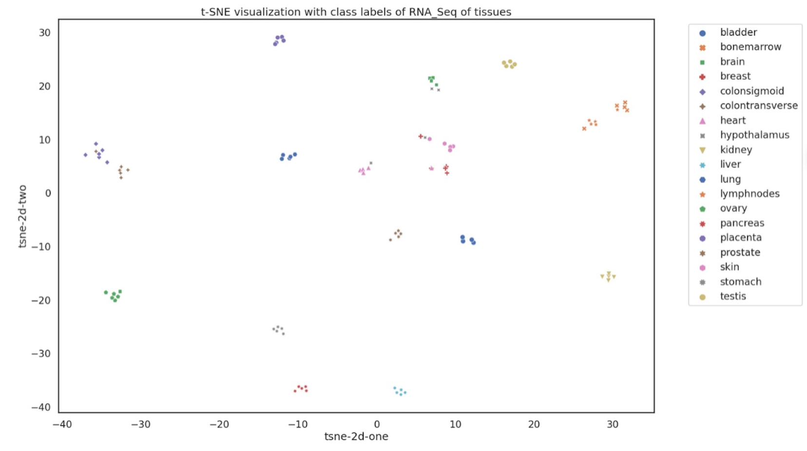

# 5hmC-TissueMap

## Introduction
This project focuses on creating a comprehensive tissue-specific map of 5-hydroxymethylcytosine (5hmC) across 19 human tissues using data from NCBI SRA and bioinformatics analysis. The goal is to investigate the role of 5hmC in gene regulation, tissue differentiation, and its potential as a biomarker.

## Objectives
- Generate genome-wide 5hmC distribution profiles for 19 human tissues.
- Identify common and tissue-specific features of 5hmC distribution.
- Functionally profile each of the 5hmC samples and identify tissue-specific motif regions.

## Tools and Technologies
- **HOMER:** For peak annotation.
- **Bowtie2:** For sequence alignment.
- **MACS2:** For peak calling.
- **Bedtools:** For sorting and merging peak files.
- **Metascape:** For pathway enrichment analysis.
- **EnrichR:** For Gene Ontology analysis.
- **Shell Scripting:** Automating the preprocessing step.

## Methodology
1. **Data Collection:**
   - Downloaded 96 tissue-specific narrow peak files from GSE144530.
   - Used bedtools to sort and merge narrow peak files for each tissue.

2. **Preprocessing:**
   - Alignment of raw reads using Bowtie2.
   - Peak calling using MACS2.
   - Annotation of peaks using HOMER.

3. **Analysis:**
   - t-SNE clustering of RNA-seq data to visualize tissue-specific clustering.
   - Pathway enrichment analysis using Metascape and EnrichR.

4. **Results:**
   - Identification of 5hmC-enriched regions and their regulatory potential.
        The -5 kb to 5kb range was seen as a common hotspots for region-gene associations across tissues. This emphasizes the significance of epigenetic modifications, particularly 5hmC, in the immediate vicinity of the transcription start site (TSS) for gene expression regulation
   - The distributions and concentrations of 5hmC modifications across the human genome were identified and examined using the 5hmC peaks detected by MACS2. 5hmC peaks were found to be overrepresented at exons and promoters, while underrepresented at intergenic regions.
   - The t-SNE clustering of 5hmC distributions within peaks distinctly separated different tissue types, while intra-tissue samples (i.e., samples from the same tissue type from different donors) were grouped together.
   
   

## Contributors
- **Amisha Gupta (MT23225)**
- **Diksha Kashyap (MT23228)**
- **Milind Chauhan (MT23232)**
